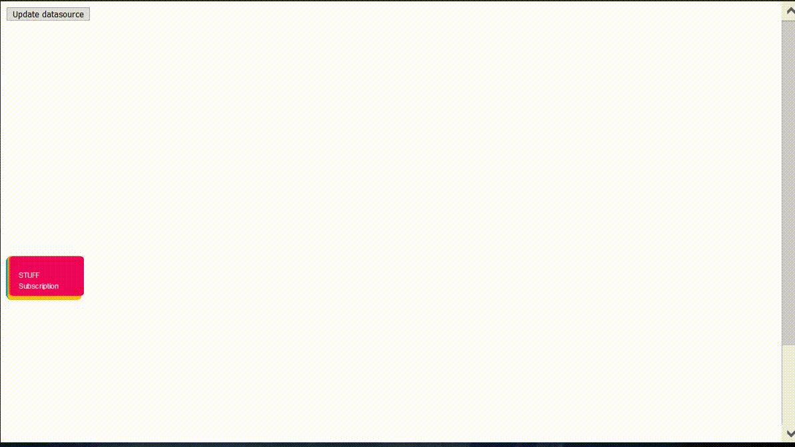

### Ng Node Map - Demo

[Module repo](https://github.com/mikerossoft/angular-node-map/)



# Prerequisite

## Install font-awesome

`npm i font-awesome@^4.7.0`

## Configure Font Awesome in your Angular project

Under the angular.json file, add the font-awesome css file into the styles list

```javascript
"styles": [
    "src/styles.scss",
    "./node_modules/font-awesome/css/font-awesome.css"
],
```

# Usage

## Import `NodeMapModule` to your module list:

```javascript
import { NodeMapModule } from 'ng-node-map';

@NgModule({
declarations: [AppComponent],
imports: [BrowserModule, NodeMapModule],
providers: [],
bootstrap: [AppComponent],
})
```

## Setup in your HTML file

```html
<app-node-map
  [dataSource]="dataSourceJson"
  [onEdit]="onEditCallback"
  [onDelete]="onDeleteCallback"
  [onAdd]="onAddCallback"
  [onSelect]="onSelectCallback"
></app-node-map>
```

## Setup in your component ts file

```javascript
import { NodeMapModule } from 'ng-node-map';
...
export class AppComponent implements OnInit {
    @ViewChild(NodeMapModule) nodeMap: NodeMapModule;
    dataSourceJson = {};
        public onDeleteCallback = (item?: any): void => {
        console.log(`onDelete - item: ${item} uri:${item.uri}`);
    };
    public onEditCallback = (item?: any): void => {
        console.log(`onEdit - item: ${item} uri:${item.uri}`);
    };
    public onAddCallback = (item?: any): void => {
        console.log(`onAdd - item: ${item} uri:${item.uri}`);
    };
    public onSelectCallback = (item?: any): void => {
        console.log(`onSelect - item: ${item} uri:${item.uri}`);
    };
    //your JSON data for generating the Node Map e.g.
        dataBusData: object = {
            root: {
                name:'DataBus',
                nodes: [
                    {
                        uri: 'id-1',
                        name: 'SCADA',
                        description: 'Stuff',
                        plugin: 'OPC HDA',
                        type: 'Connector',
                        bodyColour: '#1976D2',
                        borderColour: '#FFF',
                        canAdd: false,
                        canEdit: true,
                        canDelete: true,
                        ...
                    }
                ]
            }
        }
    ngOnInit(): void {
        this.dataSourceJson = dataBusData;
    }
}
```

## Execute your project

`ng serve -o`
